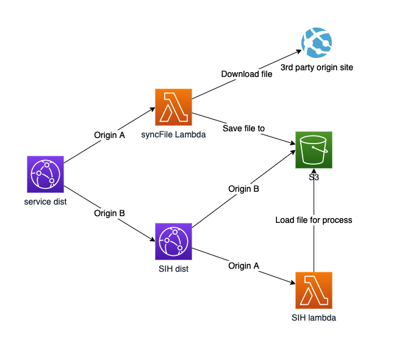
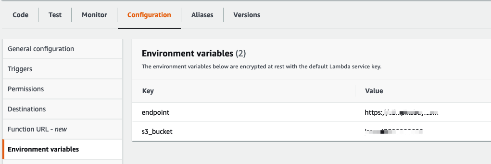
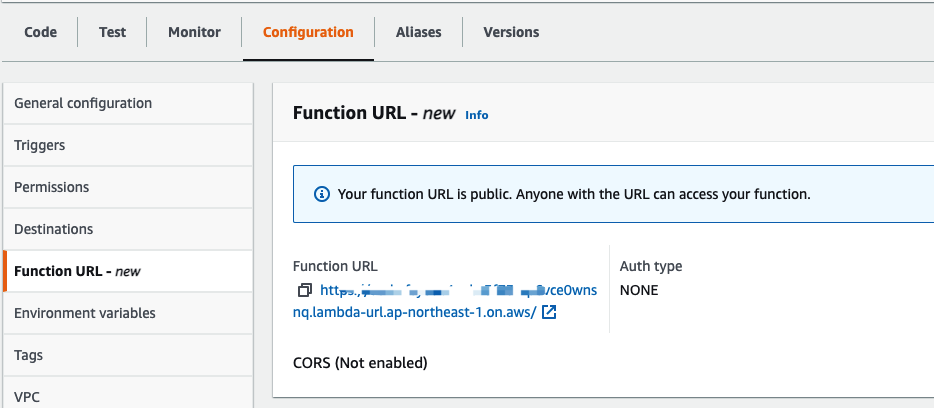

### lambda 镜像回源配置指引
#### 用途
通过CloudFront origin group fallover功能，借助Lambda从第三方站点同步文件至S3桶，进而使[SIH](https://github.com/wchaws/serverless-image-handler)支持以第三方站点作为源站。

架构图示意如下


#### 配置流程
1. 参考[这里](https://docs.qq.com/doc/DV3ZVWEtTU0ZFWFpi)部署SIH x-oss-process版本

2. 部署Lambda函数，参考[这里](https://github.com/keithrozario/Klayers/tree/master/deployments/python3.9)添加Requests Layer

#### Lambda 环境变量
* endpoint: 外部站点URL
* s3_bucket: s3桶名称



#### Lambda 权限

* 额外添加S3桶访问权限

#### Lambda URL配置


#### CloudFront配置

* origin A: Lambda URL
* origin B: SIH CloudFront URL


#### 参考资料

1. [Lambda URL](https://aws.amazon.com/blogs/aws/announcing-aws-lambda-function-urls-built-in-https-endpoints-for-single-function-microservices/)

2. Lambda URL event 格式

```json
{
  "version": "2.0",
  "routeKey": "$default",
  "rawPath": "/photo/2018/08/14/13/23/ocean-3605547_960_720.jpg",
  "rawQueryString": "x-oss-process=image/resize,w_150/circle,r_100",
  "headers": {
    "x-amzn-trace-id": "Root=1-6252fa07-79d7a777368eae41c19",
    "x-forwarded-proto": "https",
    "host": "eczhzfsyouc4vnbx3f73mp6vce0wxxxx.lambda-url.ap-northeast-1.on.aws",
    "x-forwarded-port": "443",
    "x-forwarded-for": "13.248.48.12",
    "x-amz-cf-id": "2pygthUgDQ9PmrtyWOjer3GEDGQaDu0q4dmAZ0Npx2MOlQ==",
    "accept": "text/html,application/xhtml+xml,application/xml;q=0.9,image/avif,image/webp,image/apng,*/*;q=0.8,application/signed-exchange;v=b3;q=0.9",
    "user-agent": "Amazon CloudFront",
    "via": "2.0 1b188969aee360ace67a42f.cloudfront.net (CloudFront)"
  },
  "queryStringParameters": {
    "x-oss-process": "image/resize,w_150/circle,r_100"
  },
  "requestContext": {
    "accountId": "anonymous",
    "apiId": "eczhzfsyouc4vnbx3f73mp6vce0wxxxx",
    "domainName": "eczhzfsyouc4vnbx3f73mp6vce0wxxxx.lambda-url.ap-northeast-1.on.aws",
    "domainPrefix": "eczhzfsyouc4vnbx3f73mp6vce0wxxxx",
    "http": {
      "method": "GET",
      "path": "/photo/2018/08/14/13/23/ocean-3605547_960_720.jpg",
      "protocol": "HTTP/1.1",
      "sourceIp": "64.252.103.125",
      "userAgent": "Amazon CloudFront"
    },
    "requestId": "a5322273-cedf-4a6b-b1fa-86bfa0b",
    "routeKey": "$default",
    "stage": "$default",
    "time": "10/Apr/2022:15:38:47 +0000",
    "timeEpoch": 1649605127949
  },
  "isBase64Encoded": False
}
```